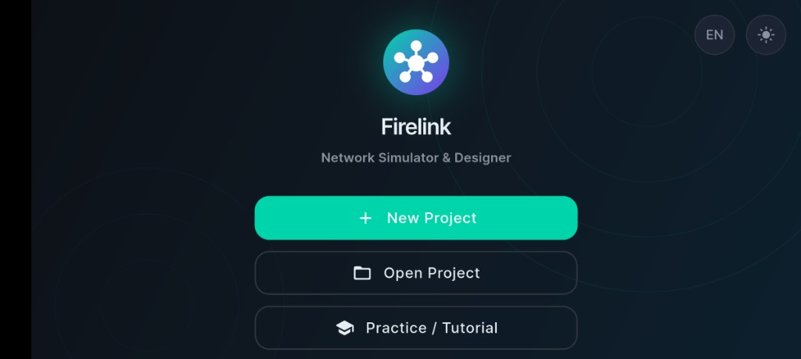
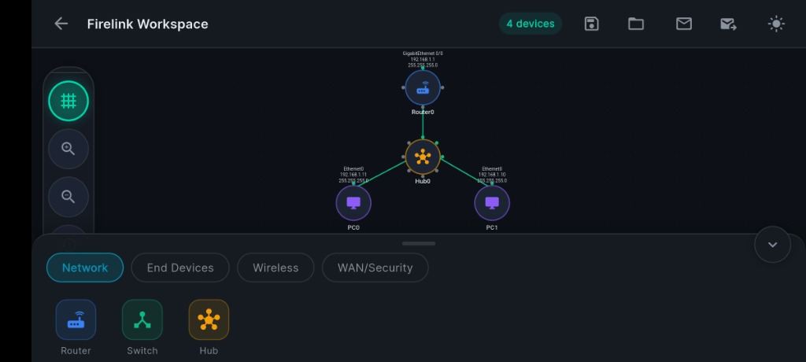
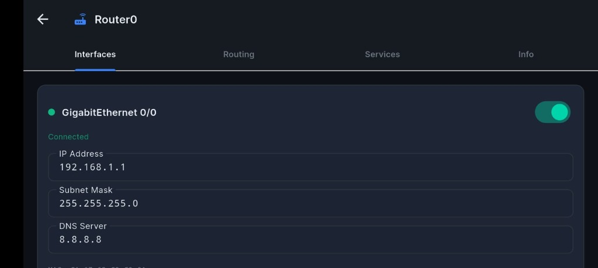
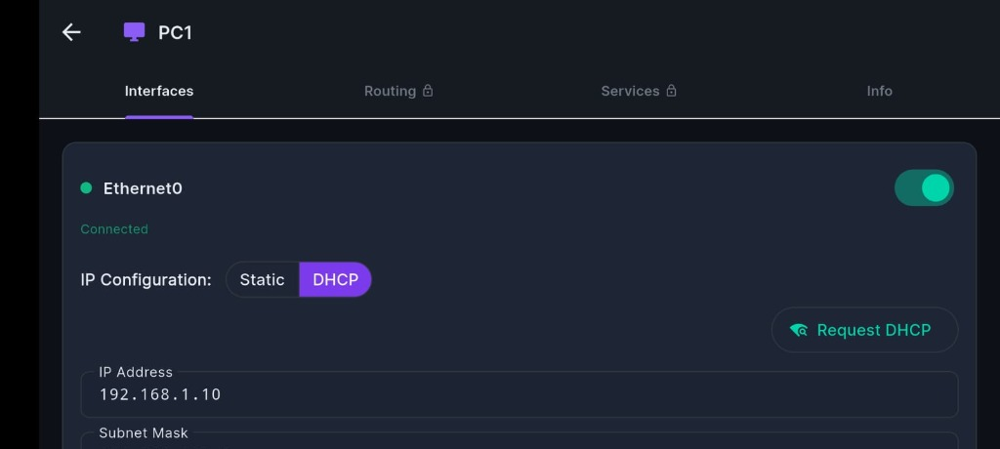
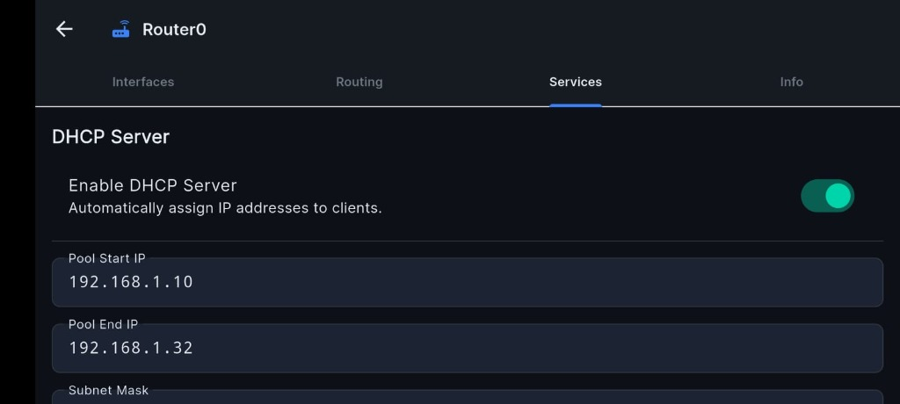
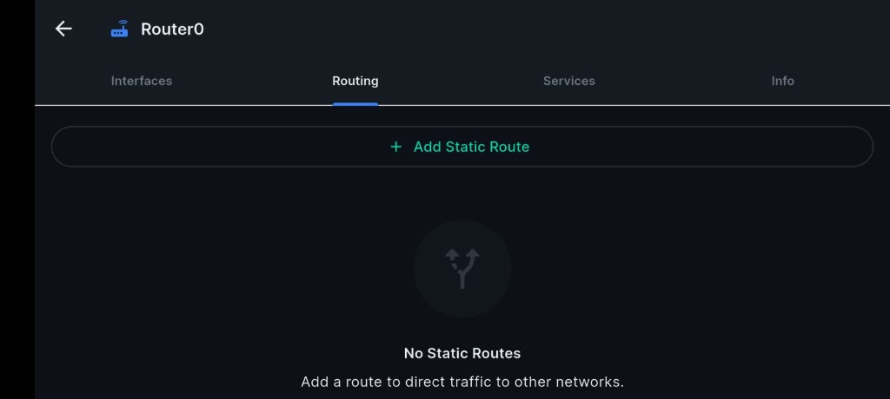
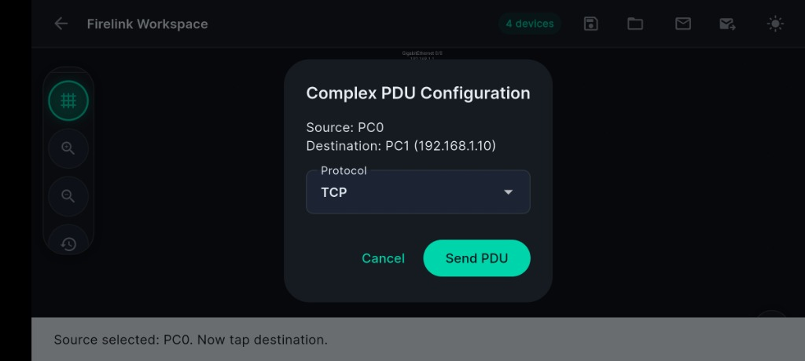
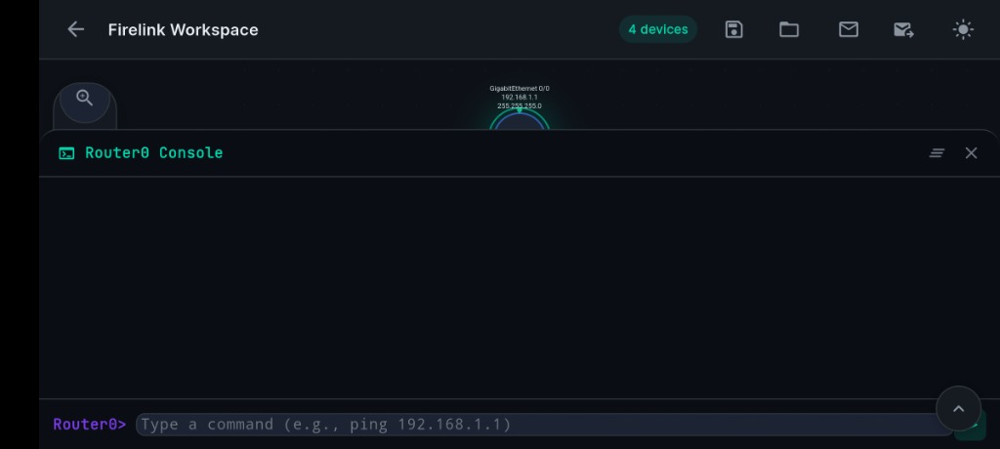
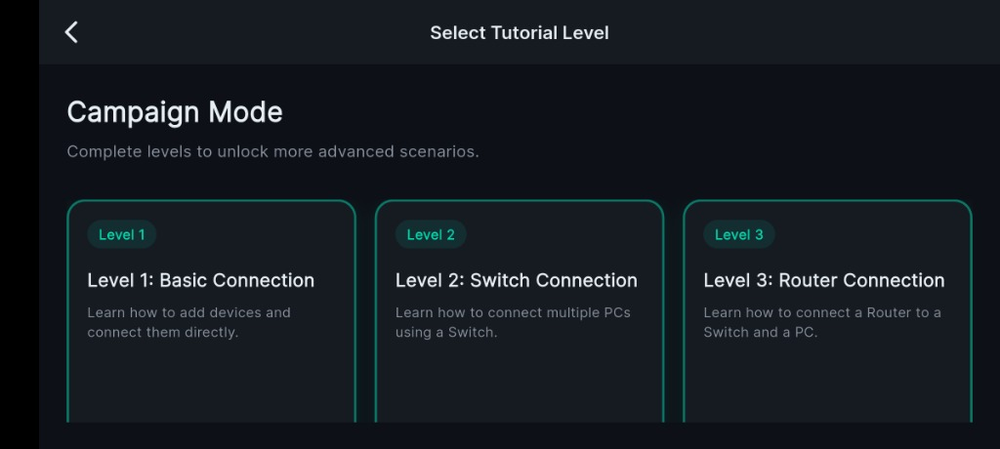

# Firelink


**Firelink** is a high-performance, visually stunning Network Topology Simulation and Configuration tool built entirely with **Flutter**. Designed for both students learning networking concepts and professionals visualizing architectures, Firelink allows you to dynamically build, configure, and simulate complex network interactions right on your device.

---

## Features

- **Infinite Workspace Canvas**: Drag and drop devices, draw connections, and arrange your architecture on a hardware-accelerated infinite panning and zooming grid.
- **Comprehensive Device Configuration**: 
  - Manage IPv4 addresses, Subnet Masks, Default Gateways, and DNS servers per interface.
  - Configure Hostnames, Static Routing Tables, and Access Control Lists (ACLs).
- **Packet Simulation (PDU)**: 
  - **Simple PDU**: Quickly test reachability between two nodes.
  - **Complex PDU**: Construct detailed custom packets (custom TTL, specific source/destination IPs) and watch their animated journey across your topology.
- **Campaign / Tutorial Mode**: Interactive built-in lessons (Level 1 to Level 5) designed to teach networking basics, from linking simple devices to configuring routers and DHCP servers.
- **Project Persistence**: Save your topology locally as `.firelink` files and load them up later instantly using Isolate-based background parsing.
- **Bilingual & Theming**: Full support for Dark/Light mode and bilingual localization (English & Bahasa Indonesia).
- **Ultra-Optimized Performance**: Built without heavy `RepaintBoundary` wrappers, rendering hundreds of devices at a buttery smooth 60 FPS using raw Matrix Inversion and PointMode algorithms.

---

## Getting Started

### Prerequisites
- [Flutter SDK](https://docs.flutter.dev/get-started/install) (latest stable version recommended)
- A connected device or emulator (Android, iOS, Windows, macOS, Linux, or Web)

### Installation
1. Clone the repository:
   ```bash
   git clone https://github.com/yourusername/firelink.git
   ```
2. Navigate to the project directory:
   ```bash
   cd firelink
   ```
3. Get the dependencies:
   ```bash
   flutter pub get
   ```
4. Run the app:
   ```bash
   flutter run
   ```

---

## Tech Stack & Architecture

- **Framework**: Flutter / Dart
- **State Management**: `Provider` (ChangeNotifier based architecture)
- **Canvas Rendering**: Raw `CustomPainter` optimized with `Matrix4` math for minimal VRAM usage.
- **Storage**: `shared_preferences` for app settings, `file_picker` & `path_provider` for saving JSON-based `.firelink` topological structures.

---

## Screenshots

### Core Interface
| Home Menu | Workspace |
| --- | --- |
|  |  |

### Device Configuration
| Router Interfaces | PC Interfaces |
| --- | --- |
|  |  |

### Network Services
| DHCP Server | Static Routing |
| --- | --- |
|  |  |

### Simulation & CLI
| Complex PDU Configuration | Router Console |
| --- | --- |
|  |  |

### Learning
**Tutorial / Campaign Mode**
<br>


---

## Contributing

Contributions, issues, and feature requests are welcome! 
Feel free to check [issues page](https://github.com/AkaneKanzaki/firelink/issues) if you want to contribute.

---

## License

This project is licensed under the MIT License - see the [LICENSE](LICENSE) file for details.
